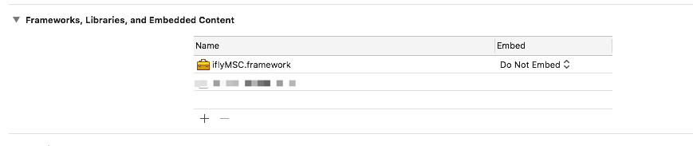

# ASC_EXT 接入文档

### 1. 集成方式

#### CocoaPods 集成（推荐）

   1. 安装CocoaPods

   2. 准备 Podfile
   ```ruby
   # CocoaPods master repo，如果使用其他的镜像源，此行可修改
   source 'https://github.com/CocoaPods/Specs.git' 
   
   # ASC 依赖 CocoaPods Repo，必填
   source 'https://pt.singsound.com:10081/singsound-public/SingSoundSDKCocoaPodRepo.git'
   source 'https://github.com/alo7/ios-repo.git'
   
   target 'YourTargetName' do
         platform :ios, "9.0"
         pod 'ASC_EXT'
   end
   ```
      
   3. 添加讯飞 SDK。
   由于 SDK 内部使用讯飞进行语音评测功能，而讯飞 SDK 与应用 APP ID 一一绑定，无法使用 CocoaPods 指定依赖，需要由用户自行导入 Framework。

### 2. 使用方式

1. 引入 Framework

   ```objective-c
   #import <ASC_EXT/ASC_EXT.h>
   ```

2. 初始化 SDK

   ```objective-c
   // 推荐在 AppDelegate didFinishLaunchingWithOptions 方法中初始化SDK
   NSDictionary *context = @{
        iflytekAppId: @"xxxxx" // 讯飞 APP ID,
        singsoundKey: @"xxxxx" // 先声 SDK APP Key,
        singsoundSecret: @"xxxxx" // 先声 SDK APP Secret,
    };
   
    // 初始化 SDK
    [ASCSDK initialize:context];
   ```

3. 开始一节课程

   ```objective-c
    // 通过 Lesson ID 创建 ASCSession
    self.session = [[ASCSession alloc] initLessonId:-1];
    self.session.userId = @"xxxxxx";
   
    // 课程模式
    self.session.mode = ASCLessonModeClass; 
    
    // 设置唯一鉴权 token
    self.session.token = @"xxxxxx";
   
    // 设置代理 (可选)
    self.session.delegate = self;

    // 开始上课
    [ASCSDK startBySession:self.session fromViewController:self];
   ```
   
4. 回调方法

   ```objective-c
      // ASC Session 相关回调方法
      - (void)ascSessionDidStart:(ASCSession *)session {
          // 课程开始
      }
      
      - (void)ascSessionDidExit:(ASCSession *)session {
          // 课程结束
      }
      
      - (void)ascSession:(ASCSession *)session didOccurError:(NSError *)error {
          // 错误处理
      }
   ```